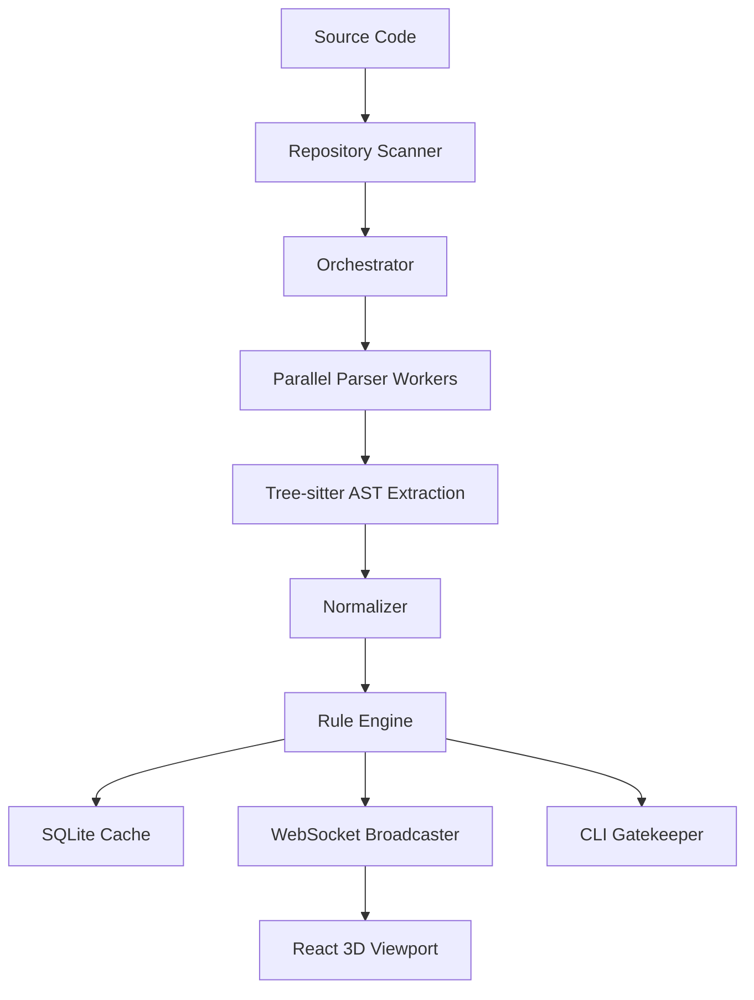

# PheonixVirtualizer Architecture

This document provides a deep dive into the internal mechanics of PheonixVirtualizer.

## 1. High-Level Data Flow

## 2. Component Responsibilities

### Scanner (`backend/app/core/scanner.py`)
-   Recursive directory walking.
-   Ignoring noise (`node_modules`, `.git`, etc.).
-   Calculating file hashes for change detection.

### Orchestrator (`backend/app/core/orchestrator.py`)
-   Manages the lifecycle of a single analysis job.
-   Uses `ProcessPoolExecutor` to parallelize I/O and CPU-bound parsing.
-   Coordinates between the Scanner, Normalizer, and Rule Engine.

### Normalizer (`backend/app/core/normalizer.py`)
-   The "contract bridge" layer.
-   Pass 1: Builds a Global Symbol Table from all exports.
-   Pass 2: Resolves imports into edges and performs semantic verification.
-   Computes folder-level health metrics.

### Rule Engine (`backend/app/core/rules.py`)
-   Pure function evaluator for architectural constraints.
-   Uses `networkx` for cycle detection.
-   Evaluates `.pheonix.yml` laws.

### AI Reasoning (`backend/app/services/ai_reasoning.py`)
-   Wraps the Gemini 1.5 Flash API.
-   Accepts topological sub-graphs and produces refactoring reports.

## 3. The Contract: `NormalizedGraph`

All components communicate through a unified Pydantic model (`backend/app/models/types.py`). This ensures that the 3D renderer, the CLI, and the AI service all see the same deterministic state of the world.

## 4. UI/UX Strategy

The frontend (`frontend/src/components/DependencyGraph3D.tsx`) uses a force-directed layout with O(1) adjacency lookups to maintain performance. 
-   **Highlighting:** Dimming unrelated nodes to show the "blast radius" of a dependency.
-   **Filtering:** Real-time toggling of node types and statuses.
